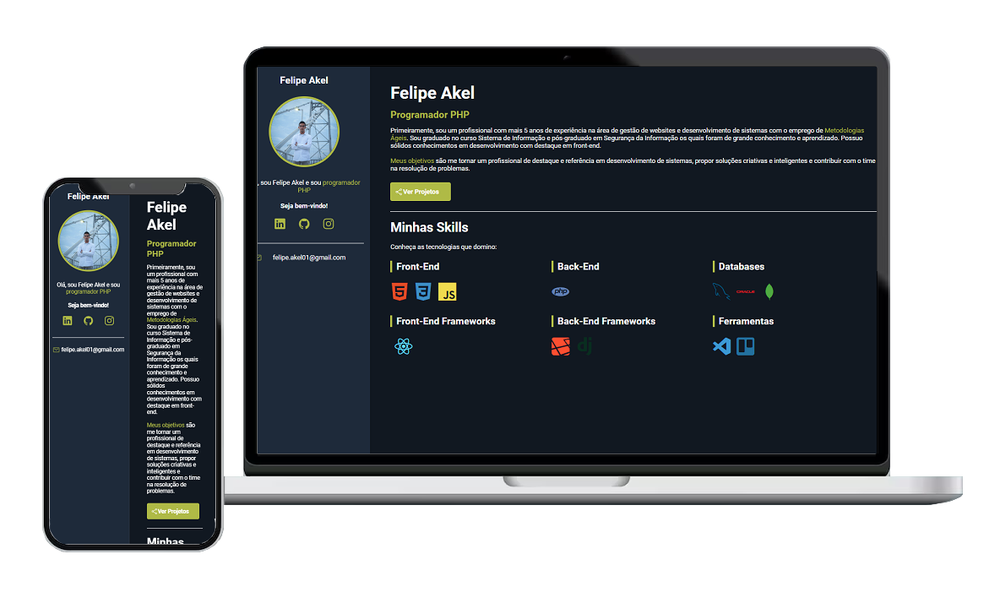

## Sobre Portfólio 'Git e GitHub'

Ao concluir o curso de Git e GitHub é importante praticar os comandos aprendidos para fixar o conteúdo. Logo, aproveitei para praticar o HTML e CSS para criar um mini portfólio para pra ticar os comandos.

## Tecnologias utilizadas

O projeto foi codificado do zero com HTML e CSS.

- **HTML**
- **CSS**
- **Comandos Git**

## Licença

O projeto contém a licença MIT